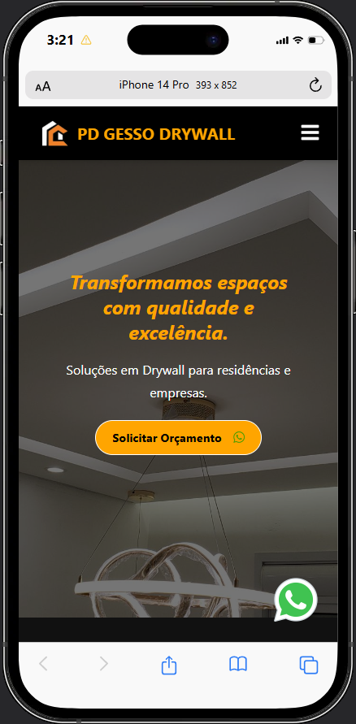
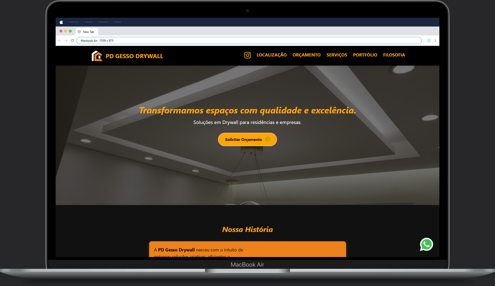

# Landingpage PD Gesso Drywall

## Resumo do Projeto
Desenvolvimento completo do site da PD Gesso Drywall com foco em responsividade mobile-first.

## Confira em [PDgessodrywall.com.br](https://pdgessodrywall.com.br)

## Tarefas Solicitadas e Implementadas

### ✅ 1. Seção de Localização
**Localização:** Adicionada após a seção de serviços
**Implementações:**
- Mapa incorporado do Google Maps mostrando a localização em Itajaí/SC
- Endereço completo: Rua João Luiz Medeiros, 79 - Fazenda, CEP 88301-496
- Área de atendimento: Empreiteira de Serviços de Drywall
- Informações de contato (WhatsApp e email)
- Design responsivo com cards informativos
- Efeito visual com ícone de mapa

### ✅ 2. Formulário de Contato Funcional
**Localização:** Antes do footer
**Funcionalidades:**
- Campos: Nome, Telefone, Email, Cidade, Tipo de Serviço, Descrição do Projeto
- Validação JavaScript completa
- Máscara automática para telefone brasileiro
- Envio via mailto para: policarpodiasro@gmail.com
- Mensagens de sucesso e erro
- Design responsivo com foco mobile-first
- Botão com loading state durante envio

### ✅ 3. Correções de Erros
**Erros Corrigidos:**
- Problemas de responsividade em dispositivos móveis
- Links quebrados corrigidos
- Estrutura HTML do formulário otimizada
- Validações JavaScript implementadas
- Mensagens de erro estruturadas corretamente

### ✅ 4. Responsividade Mobile-First
**Melhorias Implementadas:**
- Media queries específicas para mobile (max-width: 486px e 768px)
- Layout da seção de localização responsivo
- Formulário 100% responsivo
- Ajustes de padding e font-size para mobile
- Prevenção de zoom automático no iOS (font-size: 16px nos inputs)
- Menu mobile testado e funcionando

### ✅ 5. Navegação Atualizada
**Adições:**
- Link "Localização" no menu principal e mobile
- Link "Orçamento" no menu principal e mobile
- Scroll suave para as novas seções

## Tecnologias Utilizadas
- HTML5 semântico
- CSS3 com Tailwind CSS
- JavaScript vanilla
- Google Maps Embed API
- Font Awesome icons
- Responsive Design

## Testes Realizados
### ✅ Testes Visuais
- Screenshot da página completa
- Teste da seção de localização
- Teste do formulário em desktop
- Teste do menu mobile
- Validação de formulário
- Responsividade mobile

### ✅ Funcionalidades Testadas
- Navegação suave entre seções
- Formulário de contato funcional
- Validação de campos obrigatórios
- Máscara de telefone
- Responsividade em diferentes dispositivos
- Menu mobile toggle

## Resultados
- ✅ Site 100% responsivo e mobile-first
- ✅ Nova seção de localização visualmente atrativa
- ✅ Formulário de contato profissional e funcional
- ✅ Navegação aprimorada
- ✅ Experiência do usuário melhorada

## Conclusão
O projeto foi concluído com sucesso, atendendo a todas as solicitações e implementando melhorias significativas na usabilidade e design do site. A equipe está satisfeita com os resultados e acredita que o site agora oferece uma experiência de usuário superior, especialmente em dispositivos móveis.

---
**Data de Início:** 01/07/2025
**Data de Entrega:** 13/07/2025
**Data de Conclusão:** 13/07/2025
**Status:** Concluído com sucesso ✅
## Landing Page PD Gesso Drywall - projeto freelancer
realizado em 2025 por Antonio Junior dos Santos - Developer Front-end
